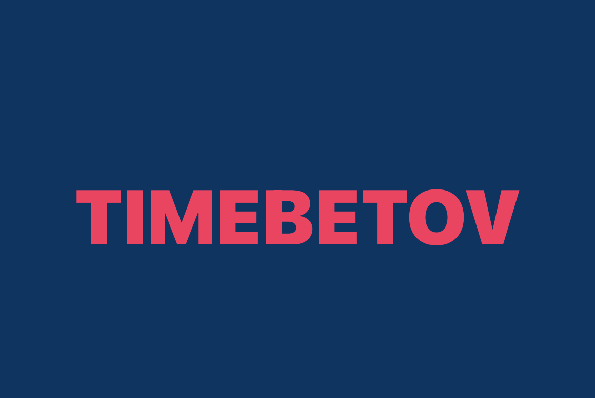

# Todo iOS app j'DIRN

## P.S. First of all, I am sorry if I will make mistakes. My English is not so good, however I'll try to explain you!

By the way this image made in Launch Screen :D
It's my first repository. And I am sorry for all... :)

### A fully functional EXAMPLE project written in Swift

### Used Core Data framework for Data Manipulation

My first pet-project is todo list app for iOS. I made it following the Angela Yu course, and I added a little bit generic code. I used patterns like MVC, Singleton, Delegate. In this application you can divide todo items into categories.

I implemented a few crucial methods from TableView. There you can add and delete items. In addition I added Search Bar. All your changes will be saved!
 

 ## Problems I have encountered.

 * So far, I do not know, but I removed the 'lazy' keyword from AppDelegate in Variable 'persistentContainer'. Because, app can not run. I could solved it, only by deleting it.
 * I could not save changes when items moved to other row. So, I decided to do not implement 'moveRowAt' methods from Table View, delegate.
 * I could not get a current selected category for using Core Data for loading all items in it. Then, I solved it by using Delegate Pattern.

 ## Go ahead to view app.
> Welcome screen
 

 ##### There you can:
* Add a new category by give name which you want, not empty!
* Remove category by swiping to left!
* And last you can go into your categories.

> Todo list page

##### There you can:
* Do things like in welcome screen except last one.
* You can search the item.
* In addition, mark as done.

## That's all. I think my first application is not perfect, however in future I'll try to make things better than now!
### All the best wishes! Timebetov...